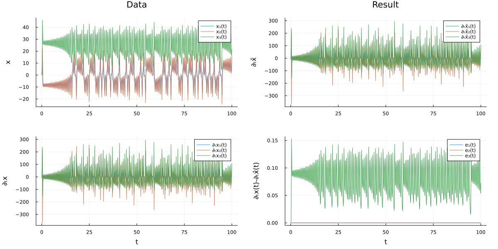

# DataDrivenDiffEq.jl

[](https://julialang.zulipchat.com/#narrow/stream/279055-sciml-bridged)
[](https://docs.sciml.ai/DataDrivenDiffEq/stable/)
[](https://zenodo.org/badge/latestdoi/212827023)

[](https://codecov.io/gh/SciML/DataDrivenDiffEq.jl)
[](https://github.com/SciML/DataDrivenDiffEq.jl/actions?query=workflow%3ACI)

[](https://github.com/SciML/ColPrac)
[](https://github.com/SciML/SciMLStyle)

DataDrivenDiffEq.jl is a package in the SciML ecosystem for data-driven differential equation
structural estimation and identification. These tools include automatically discovering equations
from data and using this to simulate perturbed dynamics.

For information on using the package,
[see the stable documentation](https://docs.sciml.ai/DataDrivenDiffEq/stable/). Use the
[in-development documentation](https://docs.sciml.ai/DataDrivenDiffEq/dev/) for the version of
the documentation which contains the un-released features.

## Quick Demonstration

```julia
## Generate some data by solving a differential equation
########################################################
using DataDrivenDiffEq
using ModelingToolkit
using OrdinaryDiffEq
using DataDrivenSparse
using LinearAlgebra

# Create a test problem
function lorenz(u, p, t)
    x, y, z = u

    ẋ = 10.0 * (y - x)
    ẏ = x * (28.0 - z) - y
    ż = x * y - (8 / 3) * z
    return [ẋ, ẏ, ż]
end

u0 = [1.0; 0.0; 0.0]
tspan = (0.0, 100.0)
dt = 0.1
prob = ODEProblem(lorenz, u0, tspan)
sol = solve(prob, Tsit5(), saveat = dt)

## Start the automatic discovery
ddprob = DataDrivenProblem(sol)

@variables t x(t) y(t) z(t)
u = [x; y; z]
basis = Basis(polynomial_basis(u, 5), u, iv = t)
opt = STLSQ(exp10.(-5:0.1:-1))
ddsol = solve(ddprob, basis, opt, options = DataDrivenCommonOptions(digits = 1))
println(get_basis(ddsol))
```

```
Explicit Result
Solution with 3 equations and 7 parameters.
Returncode: success
Sparsity: 7.0
L2 Norm Error: 26.7343984476783
AICC: 1.0013570199499398

Model ##Basis#366 with 3 equations
States : x(t) y(t) z(t)
Parameters : 7
Independent variable: t
Equations
Differential(t)(x(t)) = p₁*x(t) + p₂*y(t)
Differential(t)(y(t)) = p₃*x(t) + p₄*y(t) + p₅*x(t)*z(t)
Differential(t)(z(t)) = p₇*z(t) + p₆*x(t)*y(t)

Parameters:
   p₁ : -10.0
   p₂ : 10.0
   p₃ : 28.0
   p₄ : -1.0
   p₅ : -1.0
   p₆ : 1.0
   p₇ : -2.7
```


